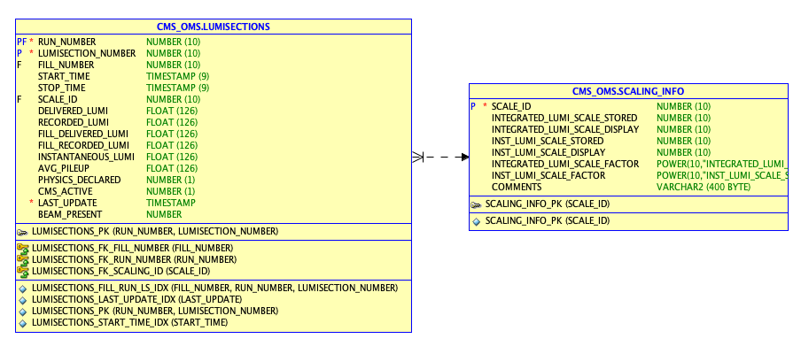
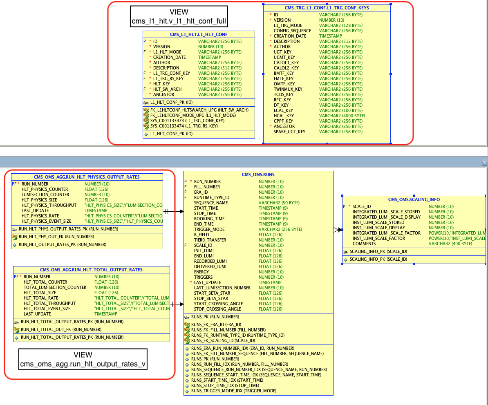
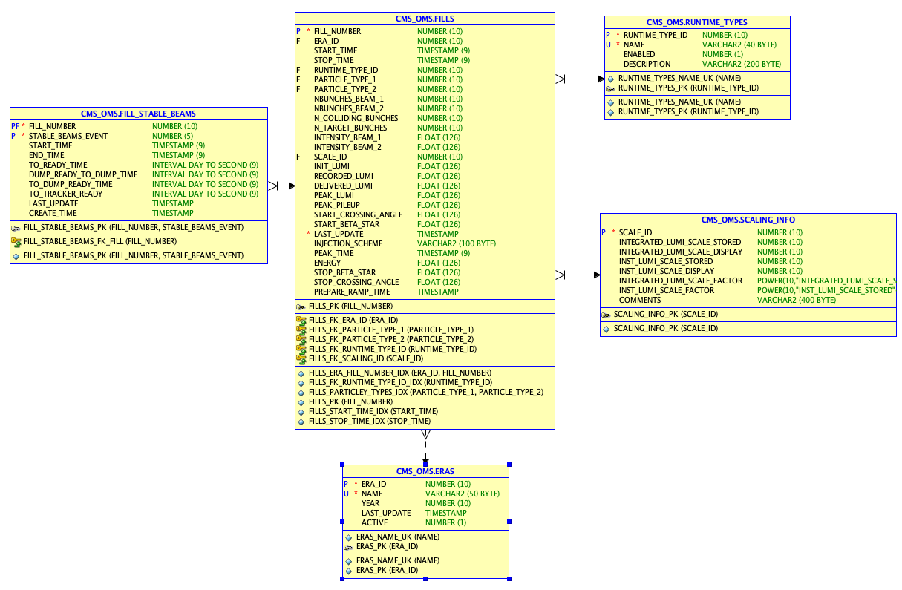
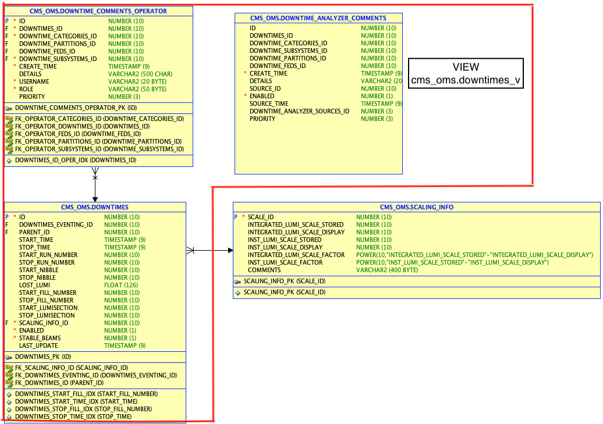

# master_thesis

```sql
--> rest request
  "GET /api/v1/lumisections?fields=lumisection_number,start_time,end_time,delivered_lumi,recorded_lumi,init_lumi,end_lumi,physics_flag&page[offset]=0&page[limit]=10&filter[cms_active][EQ]=true&filter[run_number][EQ]=385516&sort=-lumisection_number&include=meta,presentation_timestamp"
--> query that QueryBuilder created dynamically (1 main table lumisections and 1 additional scaling_info)
SELECT i.*, cnt.total_row_count__ 
FROM (
  SELECT
      l.cms_active AS cms_active,
      l.fill_delivered_lumi * scaling.integrated_lumi_scale_factor AS delivered_lumi,
      LEAD(l.instantaneous_lumi, 1, 0) OVER (ORDER BY l.run_number NULLS LAST, l.lumisection_number NULLS LAST) * scaling.inst_lumi_scale_factor AS end_lumi,
      l.stop_time AS end_time,
      l.instantaneous_lumi * scaling.inst_lumi_scale_factor AS init_lumi,
      scaling.inst_lumi_scale_display AS inst_lumi_scale_display,
      scaling.inst_lumi_scale_factor AS inst_lumi_scale_factor,
      scaling.integrated_lumi_scale_display AS integrated_lumi_scale_display,
      scaling.integrated_lumi_scale_factor AS integrated_lumi_scale_factor,
      l.lumisection_number AS lumisection_number,
      l.physics_declared AS physics_flag,
      l.fill_recorded_lumi * scaling.integrated_lumi_scale_factor AS recorded_lumi,
      ROW_NUMBER() OVER (ORDER BY l.lumisection_number DESC NULLS LAST) AS row_counter__,
      l.run_number AS run_number,
      l.start_time AS start_time
  FROM cms_oms.lumisections l 
       LEFT JOIN cms_oms.scaling_info scaling ON l.scale_id = scaling.scale_id
  WHERE l.run_number = :run_number AND l.cms_active = :cms_active
  ORDER BY lumisection_number DESC NULLS LAST) i
CROSS JOIN
  (SELECT COUNT(*) AS total_row_count__ FROM (
    SELECT
        l.cms_active AS cms_active,
        l.lumisection_number AS lumisection_number,
        l.run_number AS run_number
    FROM cms_oms.lumisections l 
    WHERE l.run_number = :run_number AND l.cms_active = :cms_active
    ORDER BY lumisection_number DESC NULLS LAST)) cnt
WHERE i.row_counter__ BETWEEN 1 AND 10
}, bindings: {positional:{}, named:{}, finder:[{run_number=385516, cms_active=1}]}
```

------------------------------
```sql
--> rest request
  "GET /api/v1/runs?fields=run_number,fill_number,stable_beam,fill_type_runtime,duration,last_lumisection_number,start_time,end_time,delivered_lumi,recorded_lumi,init_lumi,end_lumi,b_field,energy,clock_type,sequence,l1_hlt_mode_stripped,cmssw_version,initial_prescale_index,tier0_transfer,l1_key_stripped,l1_menu,l1_triggers_counter,l1_rate,hlt_key,hlt_physics_size,hlt_physics_rate,hlt_physics_counter,hlt_physics_throughput,components&page[offset]=0&page[limit]=20&filter[run_number][EQ]=385798&sort=-run_number&include=meta,presentation_timestamp"
--> query that QueryBuilder created dynamically (main table runs, 2 views and 1 addittional table: 4 different schemas)
SELECT i.*, cnt.total_row_count__ 
FROM (
SELECT
    r.b_field AS b_field,
    (SELECT rs.string_value FROM cms_runinfo.runsession_parameter rs WHERE r.run_number = rs.runnumber AND rs.name='CMS.LVL0:CLOCK_TYPE_AT_PRECONFIGURE') AS clock_type,
    (SELECT rs.string_value FROM cms_runinfo.runsession_parameter rs WHERE r.run_number = rs.runnumber AND rs.name = 'CMS.DAQ:CMSSW_VERSION') AS cmssw_version,
    (SELECT LISTAGG(rc.component_name, ',') WITHIN GROUP (ORDER BY rc.component_name) FROM cms_oms.run_components rc WHERE r.run_number = rc.run_number) AS components,
    r.delivered_lumi * scaling.integrated_lumi_scale_factor AS delivered_lumi,
    r.stop_time - r.start_time AS duration,
    r.end_lumi * scaling.inst_lumi_scale_factor AS end_lumi,
    r.stop_time AS end_time,
    r.energy AS energy,
    r.fill_number AS fill_number,
    (SELECT rt.name FROM cms_oms.runtime_types rt WHERE r.runtime_type_id = rt.runtime_type_id) AS fill_type_runtime,
    (SELECT hlt.value FROM cms_oms.trigger_keys hlt WHERE r.run_number = hlt.run_number AND hlt.name = 'HLT_KEY') AS hlt_key,
    hltr.hlt_physics_counter AS hlt_physics_counter,
    hltr.hlt_physics_rate AS hlt_physics_rate,
    hltr.hlt_physics_size AS hlt_physics_size,
    hltr.hlt_physics_throughput AS hlt_physics_throughput,
    r.init_lumi * scaling.inst_lumi_scale_factor AS init_lumi,
    (SELECT ip.prescale_index FROM cms_ugt_mon.view_lumi_sections ip WHERE r.run_number = ip.run_number AND ip.lumi_section = 1) AS initial_prescale_index,
    scaling.inst_lumi_scale_display AS inst_lumi_scale_display,
    scaling.inst_lumi_scale_factor AS inst_lumi_scale_factor,
    scaling.integrated_lumi_scale_display AS integrated_lumi_scale_display,
    scaling.integrated_lumi_scale_factor AS integrated_lumi_scale_factor,
    l1hlt.l1_hlt_key AS l1_hlt_mode_stripped,
    l1hlt.l1_trg_key AS l1_key_stripped,
    (SELECT l1conf.l1_menu FROM cms_l1_hlt.v_l1_ugt_conf l1conf WHERE r.trigger_mode = l1conf.id) AS l1_menu,
    (SELECT AVG(rates.trg_rate_total) FROM cms_tcds_monitoring.tcds_cpm_rates_v rates WHERE r.run_number = rates.run_number AND rates.trg_rate_total > 0) AS l1_rate,
    r.triggers AS l1_triggers_counter,
    r.last_lumisection_number AS last_lumisection_number,
    r.recorded_lumi * scaling.integrated_lumi_scale_factor AS recorded_lumi,
    r.run_number AS run_number,
    r.sequence_name AS sequence,
    CASE WHEN r.start_time < (SELECT MAX(NVL(sb.end_time,SYS_EXTRACT_UTC(SYSTIMESTAMP))) FROM cms_oms.fill_stable_beams sb WHERE sb.fill_number = r.fill_number) AND NVL(r.end_time,SYS_EXTRACT_UTC(SYSTIMESTAMP)) > (SELECT MIN(sb.start_time) FROM cms_oms.fill_stable_beams sb WHERE sb.fill_number = r.fill_number) THEN 1 ELSE 0 END AS stable_beam,
    r.start_time AS start_time,
    r.tier0_transfer AS tier0_transfer
FROM cms_oms.runs r 
     LEFT JOIN cms_oms_agg.run_hlt_output_rates_v hltr ON r.run_number = hltr.run_number
     LEFT JOIN cms_l1_hlt.v_l1_hlt_conf_full l1hlt ON r.trigger_mode = l1hlt.id
     LEFT JOIN cms_oms.scaling_info scaling ON r.scale_id = scaling.scale_id
WHERE r.run_number IN (SELECT run_number FROM (SELECT
    ROW_NUMBER() OVER (ORDER BY r.run_number DESC NULLS LAST) AS row_counter__,
    r.run_number AS run_number
FROM cms_oms.runs r 
WHERE r.run_number = :run_number
ORDER BY run_number DESC NULLS LAST) WHERE row_counter__ BETWEEN 1 AND 20)
ORDER BY run_number DESC NULLS LAST) i
CROSS JOIN 
(SELECT COUNT(*) AS total_row_count__ FROM (
  SELECT
      r.run_number AS run_number
  FROM cms_oms.runs r 
  WHERE r.run_number = :run_number
  ORDER BY run_number DESC NULLS LAST)) cnt
}, bindings: {positional:{}, named:{}, finder:[{run_number=385798}]}
```

------------------------------    
```sql
--> rest request
  "GET /api/v1/fills?fields=fill_number,duration,start_time,start_stable_beam,end_stable_beam,end_time,delivered_lumi,delivered_lumi_stablebeams,recorded_lumi,recorded_lumi_stablebeams,efficiency_time,efficiency_lumi,peak_lumi,peak_pileup,fill_type_runtime,injection_scheme,crossing_angle,beta_star_start,beta_star_stop,energy,bunches_colliding,bunches_target,bunches_beam1,bunches_beam2,intensity_beam1,intensity_beam2,b_field,era&page[offset]=0&page[limit]=20&filter[fill_number][EQ]=10122&sort=-fill_number&include=meta,presentation_timestamp"
--> query that QueryBuilder created dynamically (
SELECT
    (SELECT AVG(r.b_field) FROM cms_oms.runs r WHERE f.fill_number = r.fill_number) AS b_field,
    f.start_beta_star AS beta_star_start,
    f.stop_beta_star AS beta_star_stop,
    f.nbunches_beam_1 AS bunches_beam1,
    f.nbunches_beam_2 AS bunches_beam2,
    f.n_colliding_bunches AS bunches_colliding,
    f.n_target_bunches AS bunches_target,
    f.start_crossing_angle AS crossing_angle,
    f.delivered_lumi * scaling.integrated_lumi_scale_factor AS delivered_lumi,
    (SELECT CMS_OMS_AGG.data_summary.get_fill_delivered_lumi(f.fill_number) FROM dual ) * scaling.integrated_lumi_scale_factor AS delivered_lumi_stablebeams,
    (SELECT NVL(SUM(round( extract( second from (dt.stop_time - dt.start_time) ) + extract( minute from (dt.stop_time - dt.start_time) ) * 60 + extract( hour from (dt.stop_time - dt.start_time) ) * 60 * 60 + extract( day from (dt.stop_time - dt.start_time) ) * 60 * 60 * 24)), 0) FROM cms_oms.downtimes dt WHERE f.fill_number = dt.start_fill_number AND dt.stable_beams = 1) AS downtime,
    NVL(sb.end_time, SYS_EXTRACT_UTC(SYSTIMESTAMP)) - sb.start_time AS duration,
    100 * f.recorded_lumi / NULLIF(f.delivered_lumi, 0) AS efficiency_lumi,
    sb.end_time AS end_stable_beam,
    f.stop_time AS end_time,
    f.energy AS energy,
    e.name AS era,
    f.fill_number AS fill_number,
    rt.name AS fill_type_runtime,
    f.injection_scheme AS injection_scheme,
    scaling.inst_lumi_scale_display AS inst_lumi_scale_display,
    scaling.inst_lumi_scale_factor AS inst_lumi_scale_factor,
    scaling.integrated_lumi_scale_display AS integrated_lumi_scale_display,
    scaling.integrated_lumi_scale_factor AS integrated_lumi_scale_factor,
    f.intensity_beam_1 AS intensity_beam1,
    f.intensity_beam_2 AS intensity_beam2,
    f.peak_lumi * scaling.inst_lumi_scale_factor AS peak_lumi,
    f.peak_pileup AS peak_pileup,
    f.recorded_lumi * scaling.integrated_lumi_scale_factor AS recorded_lumi,
    (SELECT CMS_OMS_AGG.data_summary.get_fill_recorded_lumi(f.fill_number) FROM dual ) * scaling.integrated_lumi_scale_factor AS recorded_lumi_stablebeams,
    sb.start_time AS start_stable_beam,
    f.start_time AS start_time
FROM cms_oms.fills f 
     LEFT JOIN cms_oms.scaling_info scaling ON f.scale_id = scaling.scale_id
     LEFT JOIN cms_oms.runtime_types rt ON f.runtime_type_id = rt.runtime_type_id
     LEFT JOIN cms_oms.eras e ON f.era_id = e.era_id
     LEFT JOIN cms_oms.fill_stable_beams sb ON f.fill_number = sb.fill_number AND sb.stable_beams_event = 1
WHERE f.fill_number = :fill_number
ORDER BY fill_number DESC NULLS LAST
FETCH FIRST 20 ROWS ONLY
}, bindings: {positional:{}, named:{}, finder:[{fill_number=10122}]}
```

------------------------------
```sql
--> rest request
  "GET /api/v1/downtimesrun3?fields=start_time,stop_time,duration,lost_lumi,group,category,subsystem,details&page[offset]=0&page[limit]=100&filter[start_run_number][EQ]=385799&sort=-start_time&include=meta,presentation_timestamp"
--> query that QueryBuilder created dynamically (the resource is a view in db, getting data from 4 different tables)
SELECT i.*, cnt.total_row_count__ 
FROM (
  SELECT
      dt.category_name AS category,
      dt.details AS details,
      dt.downtimes_id AS downtime_id,
      dt.duration AS duration,
      dt.group_name AS group_name,
      scaling.integrated_lumi_scale_display AS integrated_lumi_scale_display,
      scaling.integrated_lumi_scale_factor AS integrated_lumi_scale_factor,
      dt.lost_lumi * scaling.integrated_lumi_scale_factor AS lost_lumi,
      ROW_NUMBER() OVER (ORDER BY dt.start_time DESC NULLS LAST) AS row_counter__,
      dt.start_run_number AS start_run_number,
      dt.start_time AS start_time,
      dt.stop_time AS stop_time,
      dt.subsystem_name AS subsystem
  FROM cms_oms.downtimes_v dt 
       LEFT JOIN cms_oms.scaling_info scaling ON dt.lost_lumi_scale_id = scaling.scale_id
  WHERE dt.enabled = 1 AND dt.start_run_number = :start_run_number
  ORDER BY start_time DESC NULLS LAST) i
CROSS JOIN
  (SELECT COUNT(*) AS total_row_count__ FROM (
    SELECT
        dt.downtimes_id AS downtime_id,
        dt.start_run_number AS start_run_number,
        dt.start_time AS start_time
    FROM cms_oms.downtimes_v dt 
    WHERE dt.enabled = 1 AND dt.start_run_number = :start_run_number
    ORDER BY start_time DESC NULLS LAST)) cnt
WHERE i.row_counter__ BETWEEN 1 AND 100
}, bindings: {positional:{}, named:{}, finder:[{start_run_number=385799}]}
```

------------------------------
```sql
--> rest request
  "GET /api/v1/hltpathinfo?fields=path_name,l1_pass,ps_pass,accepted,excepted,rejected,rate,run_number&page[offset]=0&page[limit]=20&filter[run_number][EQ]=385516&sort=-path_name&include=meta,presentation_timestamp"
--> when loading page ~7 rest requests
-->query that QueryBuilder created dynamically (2 different schemas)
DEBUG [2024-09-12 12:57:17,120] ch.cern.cms.daq.oms.api.aggregation.utils.sql.jdbi.AggregationSqlLogger: Executed statement: {
SELECT i.*, cnt.total_row_count__ 
FROM (
  SELECT
      SUM(P.accept) AS accepted,
      SUM(P.except) AS excepted,
      SUM(P.l1pass) AS l1_pass,
      COUNT(*) AS number_lumisections,
      P.path_name AS path_name,
      SUM(P.pspass) AS ps_pass,
      SUM(P.reject) AS rejected,
      P.row_counter__ AS row_counter__,
      P.run_number AS run_number
  FROM (
      SELECT
          a.paccept AS accept,
          a.pexcept AS except,
          l.id AS id,
          l.id_path AS id_path,
          a.l1pass AS l1pass,
          a.pathid AS path_id,
          z.name AS path_name,
          a.pspass AS pspass,
          a.preject AS reject,
          DENSE_RANK() OVER (ORDER BY z.name DESC, a.pathid) AS row_counter__,
          a.runnumber AS run_number
      FROM cms_runinfo.hlt_supervisor_triggerpaths a 
           JOIN cms_hlt_gdr.u_pathids l ON a.pathid = l.pathid
           LEFT JOIN cms_hlt_gdr.u_paths z ON l.id_path = z.id
      WHERE a.runnumber = :run_number) P
  GROUP BY P.run_number, P.path_id, P.id_path, P.id, P.path_name, P.row_counter__
  ORDER BY path_name DESC NULLS LAST) i
CROSS JOIN
  (SELECT *
  FROM (
      SELECT COUNT(a.pathid) AS total_row_count__
      FROM cms_runinfo.hlt_supervisor_triggerpaths a 
       JOIN cms_hlt_gdr.u_pathids l ON a.pathid = l.pathid
       LEFT JOIN cms_hlt_gdr.u_paths z ON l.id_path = z.id
      WHERE a.runnumber = :run_number
      GROUP BY a.lsnumber)
  WHERE ROWNUM = 1) cnt
WHERE i.row_counter__ BETWEEN 1 AND 20
}, bindings: {positional:{}, named:{}, finder:[{run_number=385516}]}
```

